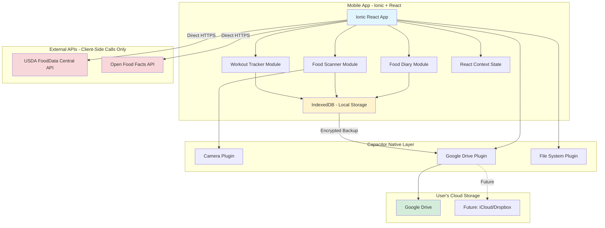
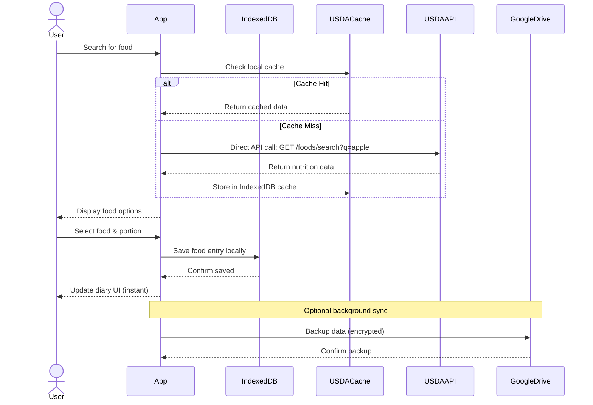
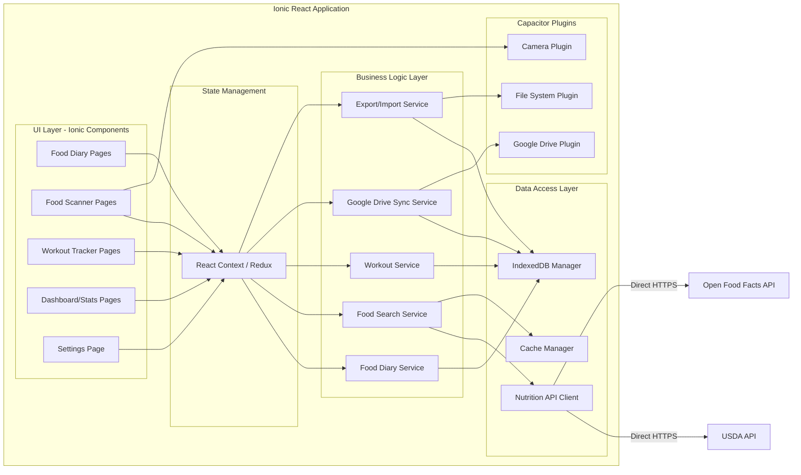
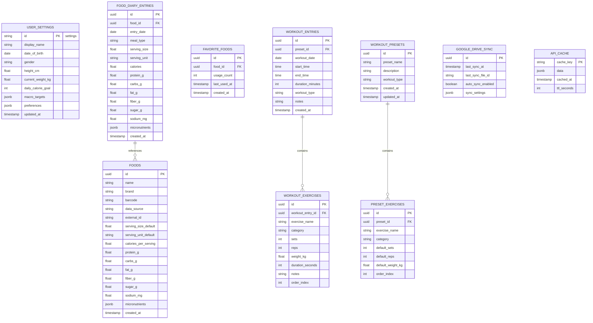
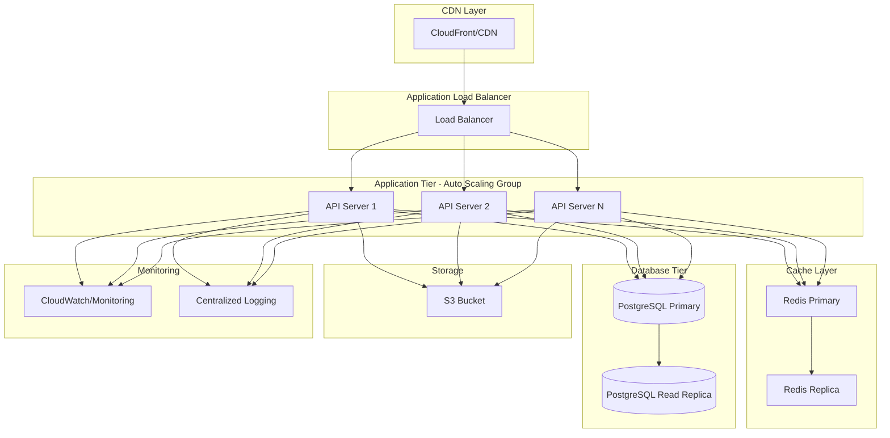
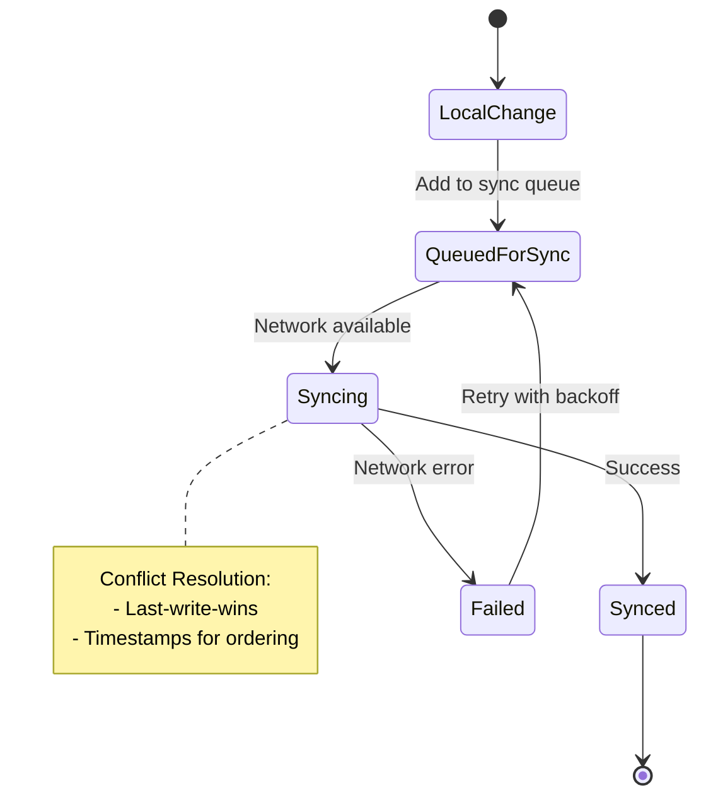

# Keyston - Architecture Documentation
## System Architecture & Technical Design

---

## Table of Contents
1. [System Overview](#1-system-overview)
2. [Architecture Diagrams](#2-architecture-diagrams)
3. [Component Architecture](#3-component-architecture)
4. [Data Architecture](#4-data-architecture)
5. [API Design](#5-api-design)
6. [Security Architecture](#6-security-architecture)
7. [Scalability & Performance](#7-scalability--performance)
8. [Development Guidelines](#8-development-guidelines)

---

## 1. System Overview

### 1.1 High-Level Architecture

Keyston follows a **privacy-first, client-only architecture** with no backend server or central database.

**Architecture Pattern**: Offline-First Progressive Web App

**Key Principles**:
- **Privacy-First**: All data stays on user's device, user controls their data
- **Zero Backend**: No servers, no databases, no infrastructure to manage
- **Offline-First**: App works 100% offline, syncs to user's cloud storage optionally
- **Modularity**: Features developed as independent modules
- **Security by Design**: Data encrypted, no user tracking or analytics
- **User Data Ownership**: Users own and control their data via Google Drive or local storage

---

## 2. Architecture Diagrams

### 2.1 System Architecture Diagram - Privacy-First



**Key Points**:
- No backend server or API gateway
- All data stored locally in IndexedDB
- Direct API calls to nutrition databases from client
- Optional encrypted backup to user's Google Drive
- Complete privacy: no user accounts, no tracking

### 2.2 Data Flow Diagram - Food Logging (Privacy-First)



**Key Privacy Features**:
- No backend server involved
- All API calls direct from client
- Data cached locally in IndexedDB
- Instant updates (no network dependency)
- Optional Google Drive backup controlled by user

### 2.3 Component Architecture Diagram - Ionic React App



**No Backend Components**:
- All logic runs in the client
- No API gateway, no authentication service
- No server-side database
- No separate backend codebase to maintain

---

### 2.4 Local Database Schema (IndexedDB)

**Privacy Note**: No user accounts - all data is local. No user_id foreign keys.



**IndexedDB Object Stores**:
- `user_settings` - Single record with user preferences
- `food_diary_entries` - All food log entries
- `foods` - Cached food nutrition data
- `favorite_foods` - User's favorite foods for quick access
- `workout_entries` - Workout log entries
- `workout_exercises` - Exercises within workouts
- `workout_presets` - Saved workout templates
- `preset_exercises` - Exercises in presets
- `google_drive_sync` - Sync metadata
- `api_cache` - Cached nutrition API responses

**No Authentication Tables**: No users, passwords, sessions, or tokens
```

### 2.5 Deployment Architecture



---

## 3. Component Architecture

### 3.1 Mobile Application Structure

```
keyston-mobile/
├── src/
│   ├── screens/
│   │   ├── auth/
│   │   │   ├── LoginScreen.tsx
│   │   │   └── RegisterScreen.tsx
│   │   ├── diary/
│   │   │   ├── FoodDiaryScreen.tsx
│   │   │   ├── AddFoodScreen.tsx
│   │   │   └── FoodDetailScreen.tsx
│   │   ├── scanner/
│   │   │   ├── FoodScannerScreen.tsx
│   │   │   └── SearchResultsScreen.tsx
│   │   ├── workout/
│   │   │   ├── WorkoutTrackerScreen.tsx
│   │   │   ├── AddWorkoutScreen.tsx
│   │   │   ├── PresetsScreen.tsx
│   │   │   └── WorkoutHistoryScreen.tsx
│   │   └── dashboard/
│   │       └── DashboardScreen.tsx
│   ├── components/
│   │   ├── common/
│   │   ├── diary/
│   │   ├── scanner/
│   │   └── workout/
│   ├── services/
│   │   ├── api/
│   │   │   ├── authService.ts
│   │   │   ├── foodService.ts
│   │   │   └── workoutService.ts
│   │   ├── storage/
│   │   │   ├── database.ts
│   │   │   └── cache.ts
│   │   └── sync/
│   │       └── syncManager.ts
│   ├── store/
│   │   ├── slices/
│   │   └── store.ts
│   ├── navigation/
│   ├── utils/
│   └── types/
```

### 3.2 Backend Service Structure

```
keyston-backend/
├── src/
│   ├── controllers/
│   │   ├── authController.ts
│   │   ├── userController.ts
│   │   ├── foodDiaryController.ts
│   │   ├── foodSearchController.ts
│   │   └── workoutController.ts
│   ├── services/
│   │   ├── authService.ts
│   │   ├── foodDiaryService.ts
│   │   ├── nutritionService.ts
│   │   └── workoutService.ts
│   ├── models/
│   │   ├── User.ts
│   │   ├── FoodDiaryEntry.ts
│   │   ├── Food.ts
│   │   └── WorkoutEntry.ts
│   ├── middleware/
│   │   ├── auth.ts
│   │   ├── validation.ts
│   │   └── errorHandler.ts
│   ├── integrations/
│   │   ├── usda/
│   │   ├── nutritionix/
│   │   └── openFoodFacts/
│   ├── database/
│   │   ├── migrations/
│   │   └── seeders/
│   ├── utils/
│   └── config/
```

---

## 4. Data Architecture

### 4.1 Data Storage Strategy

#### Local Storage (Mobile)
- **SQLite/Realm**: Structured data for offline access
- **AsyncStorage**: User preferences and settings
- **Cache**: API responses (LRU cache with TTL)

#### Cloud Storage
- **Primary Database**: PostgreSQL for structured data
- **Cache**: Redis for session data and API responses
- **File Storage**: S3 for user-uploaded images
- **Backup**: Automated daily backups with point-in-time recovery

### 4.2 Data Synchronization



**Sync Strategy**:
- **Optimistic Updates**: Apply changes locally immediately
- **Background Sync**: Queue-based synchronization
- **Conflict Resolution**: Last-write-wins with timestamp comparison
- **Retry Logic**: Exponential backoff for failed syncs

### 4.3 Caching Strategy

| Data Type | Cache Duration | Invalidation Strategy |
|-----------|---------------|----------------------|
| Food search results | 24 hours | TTL-based |
| User profile | 1 hour | On update |
| Nutrition data | 7 days | Manual refresh option |
| Recent foods | 30 days | LRU eviction |
| Workout presets | Until modified | Event-based |

---

## 5. Client-Side Data Layer Design

**Privacy-First**: No backend APIs - all operations are local

### 5.1 IndexedDB Operations

#### Local Settings Management
```javascript
// Get user settings
const settings = await db.user_settings.get('settings');

// Update daily calorie goal
await db.user_settings.put({
  id: 'settings',
  daily_calorie_goal: 2000,
  macro_targets: { protein: 150, carbs: 200, fat: 65 },
  updated_at: new Date()
});
```

#### Food Diary Operations
```javascript
// Get today's entries
const today = new Date().toISOString().split('T')[0];
const entries = await db.food_diary_entries
  .where('entry_date').equals(today)
  .toArray();

// Add food entry
await db.food_diary_entries.add({
  id: generateUUID(),
  food_id: food.id,
  entry_date: today,
  meal_type: 'lunch',
  serving_size: 150,
  serving_unit: 'g',
  calories: 247,
  protein_g: 46,
  created_at: new Date()
});

// Delete entry
await db.food_diary_entries.delete(entryId);
```

#### Food Search & Caching
```javascript
// Search with caching
async function searchFood(query) {
  const cacheKey = `search_${query}`;
  const cached = await db.api_cache.get(cacheKey);
  
  if (cached && !isCacheExpired(cached)) {
    return cached.data;
  }
  
  // Direct API call to USDA
  const response = await fetch(
    `https://api.nal.usda.gov/fdc/v1/foods/search?query=${query}&api_key=${API_KEY}`
  );
  const data = await response.json();
  
  // Cache response
  await db.api_cache.put({
    cache_key: cacheKey,
    data: data,
    cached_at: new Date(),
    ttl_seconds: 86400 // 24 hours
  });
  
  return data;
}
```

#### Favorites Management
```javascript
// Add to favorites
await db.favorite_foods.add({
  id: generateUUID(),
  food_id: food.id,
  usage_count: 1,
  last_used_at: new Date(),
  created_at: new Date()
});

// Get favorites
const favorites = await db.favorite_foods
  .orderBy('last_used_at')
  .reverse()
  .limit(20)
  .toArray();
```

#### Workout Operations
```javascript
// Save workout with exercises
const workoutId = generateUUID();
await db.workout_entries.add({
  id: workoutId,
  workout_date: new Date(),
  workout_type: 'strength',
  notes: 'Great session!',
  created_at: new Date()
});

await db.workout_exercises.bulkAdd(exercises.map((ex, i) => ({
  id: generateUUID(),
  workout_entry_id: workoutId,
  exercise_name: ex.name,
  sets: ex.sets,
  reps: ex.reps,
  weight_kg: ex.weight,
  order_index: i
})));
```

### 5.2 External API Integration (Client-Side)

#### USDA FoodData Central
```javascript
// Direct client-side API call
const searchUSDA = async (query) => {
  const url = `https://api.nal.usda.gov/fdc/v1/foods/search`;
  const params = new URLSearchParams({
    query: query,
    pageSize: 20,
    api_key: process.env.USDA_API_KEY
  });
  
  const response = await fetch(`${url}?${params}`);
  return response.json();
};
```

#### Open Food Facts (Barcode)
```javascript
// Barcode lookup - no API key needed
const lookupBarcode = async (barcode) => {
  const url = `https://world.openfoodfacts.org/api/v0/product/${barcode}.json`;
  const response = await fetch(url);
  return response.json();
};
```

### 5.3 Google Drive Sync

```javascript
// Export data to Google Drive
async function backupToGoogleDrive() {
  const allData = {
    settings: await db.user_settings.toArray(),
    food_diary: await db.food_diary_entries.toArray(),
    workouts: await db.workout_entries.toArray(),
    favorites: await db.favorite_foods.toArray(),
    presets: await db.workout_presets.toArray(),
    timestamp: new Date()
  };
  
  const encrypted = encryptData(JSON.stringify(allData));
  
  // Use Capacitor Google Drive plugin
  await GoogleDrive.uploadFile({
    filename: 'keyston_backup.enc',
    data: encrypted,
    mimeType: 'application/octet-stream'
  });
}

// Restore from Google Drive
async function restoreFromGoogleDrive() {
  const file = await GoogleDrive.downloadFile({
    filename: 'keyston_backup.enc'
  });
  
  const decrypted = decryptData(file.data);
  const allData = JSON.parse(decrypted);
  
  // Merge or replace local data
  await mergeImportedData(allData);
}
```

**No Backend APIs**:
- No authentication endpoints
- No server-side CRUD operations
- All operations are local IndexedDB transactions
- External API calls made directly from client

---

## 6. Security & Privacy Architecture

### 6.1 Privacy-First Design

**Core Privacy Principles**:
- **No User Accounts**: No registration, login, or authentication system
- **No Data Collection**: Zero telemetry, analytics, or tracking
- **Local Data Only**: All user data stored exclusively on their device
- **User Controlled Sync**: Optional Google Drive backup controlled by user
- **No Third-Party Services**: Only nutrition APIs accessed (USDA, Open Food Facts)

### 6.2 Data Protection

**Local Data Security**:
- IndexedDB storage protected by browser/OS security
- Data encrypted when backed up to Google Drive
- No transmission of personal data to external servers
- User can export/delete all data anytime

**API Security**:
- Nutrition API calls use HTTPS
- API keys stored securely (environment variables, not in code)
- Rate limiting handled client-side to prevent abuse
- No proxy server - direct API calls from client

**Google Drive Integration**:
- OAuth 2.0 authentication (user grants permission)
- Data encrypted before upload
- User can revoke access anytime
- Backup files stored in user's private Drive folder

### 6.3 Compliance

**GDPR/CCPA Compliance**:
- ✅ No personal data collected by app developer
- ✅ User has full control over their data
- ✅ Right to access: User has direct access to all data (it's on their device)
- ✅ Right to deletion: User can delete local data anytime
- ✅ Right to portability: Export to JSON/CSV supported
- ✅ No cookies or tracking

**Privacy Policy**:
- Simple, clear language
- States: "We do not collect, store, or access your data"
- Explains optional Google Drive integration
- Lists nutrition APIs accessed (USDA, Open Food Facts)

---

## 7. Performance & Scalability

### 7.1 Performance Targets

| Metric | Target | Notes |
|--------|--------|-------|
| App Launch Time | < 2s | Cold start on modern devices |
| IndexedDB Query Time | < 100ms | For typical queries |
| Food Search | < 2s | Including API call to USDA/OFF |
| UI Interaction | < 16ms | 60fps animations |
| Offline Functionality | 100% | All features work offline |

### 7.2 Optimization Strategies

**Client-Side Optimization**:
- Lazy loading of pages (Ionic router)
- Virtual scrolling for large lists
- IndexedDB indexes on frequently queried fields
- API response caching (24h for search, 7d for nutrition data)
- Image optimization and compression
- Code splitting and tree shaking

**Storage Management**:
- IndexedDB quota management (browsers typically allow GBs)
- Periodic cache cleanup (old API responses)
- User notifications if approaching storage limits
- Data export options before cleanup

### 7.3 Scalability

**User Scalability**:
- No server-side scaling needed (no backend!)
- Each user's data isolated on their device
- No shared infrastructure
- Cost doesn't scale with user count

**Data Scalability**:
- IndexedDB can handle 100,000+ entries efficiently
- Pagination and virtual scrolling for large datasets
- Background data cleanup options
- Google Drive backup for long-term storage

---

## 8. Development Guidelines

### 8.1 Code Standards

**Ionic React App (TypeScript)**:
- ESLint + Prettier for code formatting
- TypeScript strict mode enabled
- Component-based architecture
- React Hooks for state management
- Ionic components for UI consistency

**Best Practices**:
- Keep components small and focused
- Use custom hooks for reusable logic
- Implement error boundaries
- Follow Ionic design patterns
- Accessibility-first development

### 8.2 Git Workflow

```
main (production - app store releases)
  └── develop (integration)
      ├── feature/food-diary-enhancements
      ├── feature/barcode-scanner
      └── bugfix/chart-rendering
```

- **Feature Branches**: `feature/feature-name`
- **Bug Fixes**: `bugfix/bug-description`
- **Pull Requests**: Code review before merge
- **Commits**: Conventional commits format

### 8.3 Testing Strategy

**Unit Tests** (70%):
- Component logic testing with Jest
- Service layer testing
- Utility function testing
- React Testing Library for components

**Integration Tests** (20%):
- IndexedDB operations
- Nutrition API integration
- Google Drive sync flow

**E2E Tests** (10%):
- Critical user flows with Cypress/Playwright
- Food logging complete flow
- Workout creation flow
- Google Drive backup/restore

### 8.4 Privacy Testing Checklist

- [ ] Verify no data sent to servers (except nutrition APIs)
- [ ] Confirm no analytics or tracking code
- [ ] Test offline functionality (100% of features)
- [ ] Verify Google Drive encryption
- [ ] Test data export/import
- [ ] Review all network requests
- [ ] Confirm no user identifiers sent anywhere

---

*Document Version: 2.0 - Privacy-First Architecture*  
*Last Updated: November 2025*  
*Status: Complete*
