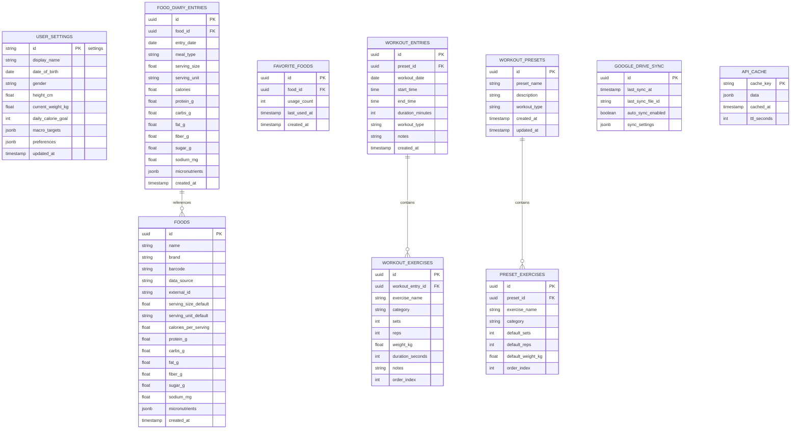

# Keyston - Architecture Documentation
## System Architecture & Technical Design

---

## Table of Contents
1. [System Overview](#1-system-overview)
2. [Architecture Diagrams](#2-architecture-diagrams)
3. [Component Architecture](#3-component-architecture)
4. [Data Architecture](#4-data-architecture)
5. [API Design](#5-api-design)
6. [Security Architecture](#6-security-architecture)
7. [Scalability & Performance](#7-scalability--performance)
8. [Development Guidelines](#8-development-guidelines)

---

## 1. System Overview

### 1.1 High-Level Architecture

Keyston follows a **privacy-first, client-only architecture** with no backend server or central database.

**Architecture Pattern**: Offline-First Progressive Web App

**Key Principles**:
- **Privacy-First**: All data stays on user's device, user controls their data
- **Zero Backend**: No servers, no databases, no infrastructure to manage
- **Offline-First**: App works 100% offline, syncs to user's cloud storage optionally
- **Modularity**: Features developed as independent modules
- **Security by Design**: Data encrypted, no user tracking or analytics
- **User Data Ownership**: Users own and control their data via Google Drive or local storage

---

## 2. Architecture Diagrams

### 2.1 System Architecture Diagram - Privacy-First


**Key Points**:
- No backend server or API gateway
- All data stored locally in IndexedDB
- Direct API calls to nutrition databases from client
- Optional encrypted backup to user's Google Drive
- Complete privacy: no user accounts, no tracking

### 2.2 Data Flow Diagram - Food Logging (Privacy-First)


**Key Privacy Features**:
- No backend server involved
- All API calls direct from client
- Data cached locally in IndexedDB
- Instant updates (no network dependency)
- Optional Google Drive backup controlled by user

### 2.3 Component Architecture Diagram - Ionic React App


**No Backend Components**:
- All logic runs in the client
- No API gateway, no authentication service
- No server-side database
- No separate backend codebase to maintain

---

### 2.4 Local Database Schema (IndexedDB)

**Privacy Note**: No user accounts - all data is local. No user_id foreign keys.



**IndexedDB Object Stores**:
- `user_settings` - Single record with user preferences
- `food_diary_entries` - All food log entries
- `foods` - Cached food nutrition data
- `favorite_foods` - User's favorite foods for quick access
- `workout_entries` - Workout log entries
- `workout_exercises` - Exercises within workouts
- `workout_presets` - Saved workout templates
- `preset_exercises` - Exercises in presets
- `google_drive_sync` - Sync metadata
- `api_cache` - Cached nutrition API responses

**No Authentication Tables**: No users, passwords, sessions, or tokens
```

### 2.5 Deployment Architecture


---

## 3. Component Architecture

### 3.1 Mobile Application Structure

```
keyston-mobile/
├── src/
│   ├── screens/
│   │   ├── auth/
│   │   │   ├── LoginScreen.tsx
│   │   │   └── RegisterScreen.tsx
│   │   ├── diary/
│   │   │   ├── FoodDiaryScreen.tsx
│   │   │   ├── AddFoodScreen.tsx
│   │   │   └── FoodDetailScreen.tsx
│   │   ├── scanner/
│   │   │   ├── FoodScannerScreen.tsx
│   │   │   └── SearchResultsScreen.tsx
│   │   ├── workout/
│   │   │   ├── WorkoutTrackerScreen.tsx
│   │   │   ├── AddWorkoutScreen.tsx
│   │   │   ├── PresetsScreen.tsx
│   │   │   └── WorkoutHistoryScreen.tsx
│   │   └── dashboard/
│   │       └── DashboardScreen.tsx
│   ├── components/
│   │   ├── common/
│   │   ├── diary/
│   │   ├── scanner/
│   │   └── workout/
│   ├── services/
│   │   ├── api/
│   │   │   ├── authService.ts
│   │   │   ├── foodService.ts
│   │   │   └── workoutService.ts
│   │   ├── storage/
│   │   │   ├── database.ts
│   │   │   └── cache.ts
│   │   └── sync/
│   │       └── syncManager.ts
│   ├── store/
│   │   ├── slices/
│   │   └── store.ts
│   ├── navigation/
│   ├── utils/
│   └── types/
```

### 3.2 Backend Service Structure

```
keyston-backend/
├── src/
│   ├── controllers/
│   │   ├── authController.ts
│   │   ├── userController.ts
│   │   ├── foodDiaryController.ts
│   │   ├── foodSearchController.ts
│   │   └── workoutController.ts
│   ├── services/
│   │   ├── authService.ts
│   │   ├── foodDiaryService.ts
│   │   ├── nutritionService.ts
│   │   └── workoutService.ts
│   ├── models/
│   │   ├── User.ts
│   │   ├── FoodDiaryEntry.ts
│   │   ├── Food.ts
│   │   └── WorkoutEntry.ts
│   ├── middleware/
│   │   ├── auth.ts
│   │   ├── validation.ts
│   │   └── errorHandler.ts
│   ├── integrations/
│   │   ├── usda/
│   │   ├── nutritionix/
│   │   └── openFoodFacts/
│   ├── database/
│   │   ├── migrations/
│   │   └── seeders/
│   ├── utils/
│   └── config/
```

---

## 4. Data Architecture

### 4.1 Data Storage Strategy

#### Local Storage (Mobile)
- **SQLite/Realm**: Structured data for offline access
- **AsyncStorage**: User preferences and settings
- **Cache**: API responses (LRU cache with TTL)

#### Cloud Storage
- **Primary Database**: PostgreSQL for structured data
- **Cache**: Redis for session data and API responses
- **File Storage**: S3 for user-uploaded images
- **Backup**: Automated daily backups with point-in-time recovery

### 4.2 Data Synchronization


**Sync Strategy**:
- **Optimistic Updates**: Apply changes locally immediately
- **Background Sync**: Queue-based synchronization
- **Conflict Resolution**: Last-write-wins with timestamp comparison
- **Retry Logic**: Exponential backoff for failed syncs

### 4.3 Caching Strategy

| Data Type | Cache Duration | Invalidation Strategy |
|-----------|---------------|----------------------|
| Food search results | 24 hours | TTL-based |
| User profile | 1 hour | On update |
| Nutrition data | 7 days | Manual refresh option |
| Recent foods | 30 days | LRU eviction |
| Workout presets | Until modified | Event-based |

---

## 5. Client-Side Data Layer Design

**Privacy-First**: No backend APIs - all operations are local

### 5.1 IndexedDB Operations

#### Local Settings Management
```javascript
// Get user settings
const settings = await db.user_settings.get('settings');

// Update daily calorie goal
await db.user_settings.put({
  id: 'settings',
  daily_calorie_goal: 2000,
  macro_targets: { protein: 150, carbs: 200, fat: 65 },
  updated_at: new Date()
});
```

#### Food Diary Operations
```javascript
// Get today's entries
const today = new Date().toISOString().split('T')[0];
const entries = await db.food_diary_entries
  .where('entry_date').equals(today)
  .toArray();

// Add food entry
await db.food_diary_entries.add({
  id: generateUUID(),
  food_id: food.id,
  entry_date: today,
  meal_type: 'lunch',
  serving_size: 150,
  serving_unit: 'g',
  calories: 247,
  protein_g: 46,
  created_at: new Date()
});

// Delete entry
await db.food_diary_entries.delete(entryId);
```

#### Food Search & Caching
```javascript
// Search with caching
async function searchFood(query) {
  const cacheKey = `search_${query}`;
  const cached = await db.api_cache.get(cacheKey);
  
  if (cached && !isCacheExpired(cached)) {
    return cached.data;
  }
  
  // Direct API call to USDA
  const response = await fetch(
    `https://api.nal.usda.gov/fdc/v1/foods/search?query=${query}&api_key=${API_KEY}`
  );
  const data = await response.json();
  
  // Cache response
  await db.api_cache.put({
    cache_key: cacheKey,
    data: data,
    cached_at: new Date(),
    ttl_seconds: 86400 // 24 hours
  });
  
  return data;
}
```

#### Favorites Management
```javascript
// Add to favorites
await db.favorite_foods.add({
  id: generateUUID(),
  food_id: food.id,
  usage_count: 1,
  last_used_at: new Date(),
  created_at: new Date()
});

// Get favorites
const favorites = await db.favorite_foods
  .orderBy('last_used_at')
  .reverse()
  .limit(20)
  .toArray();
```

#### Workout Operations
```javascript
// Save workout with exercises
const workoutId = generateUUID();
await db.workout_entries.add({
  id: workoutId,
  workout_date: new Date(),
  workout_type: 'strength',
  notes: 'Great session!',
  created_at: new Date()
});

await db.workout_exercises.bulkAdd(exercises.map((ex, i) => ({
  id: generateUUID(),
  workout_entry_id: workoutId,
  exercise_name: ex.name,
  sets: ex.sets,
  reps: ex.reps,
  weight_kg: ex.weight,
  order_index: i
})));
```

### 5.2 External API Integration (Client-Side)

#### USDA FoodData Central
```javascript
// Direct client-side API call
const searchUSDA = async (query) => {
  const url = `https://api.nal.usda.gov/fdc/v1/foods/search`;
  const params = new URLSearchParams({
    query: query,
    pageSize: 20,
    api_key: process.env.USDA_API_KEY
  });
  
  const response = await fetch(`${url}?${params}`);
  return response.json();
};
```

#### Open Food Facts (Barcode)
```javascript
// Barcode lookup - no API key needed
const lookupBarcode = async (barcode) => {
  const url = `https://world.openfoodfacts.org/api/v0/product/${barcode}.json`;
  const response = await fetch(url);
  return response.json();
};
```

### 5.3 Google Drive Sync

```javascript
// Export data to Google Drive
async function backupToGoogleDrive() {
  const allData = {
    settings: await db.user_settings.toArray(),
    food_diary: await db.food_diary_entries.toArray(),
    workouts: await db.workout_entries.toArray(),
    favorites: await db.favorite_foods.toArray(),
    presets: await db.workout_presets.toArray(),
    timestamp: new Date()
  };
  
  const encrypted = encryptData(JSON.stringify(allData));
  
  // Use Capacitor Google Drive plugin
  await GoogleDrive.uploadFile({
    filename: 'keyston_backup.enc',
    data: encrypted,
    mimeType: 'application/octet-stream'
  });
}

// Restore from Google Drive
async function restoreFromGoogleDrive() {
  const file = await GoogleDrive.downloadFile({
    filename: 'keyston_backup.enc'
  });
  
  const decrypted = decryptData(file.data);
  const allData = JSON.parse(decrypted);
  
  // Merge or replace local data
  await mergeImportedData(allData);
}
```

**No Backend APIs**:
- No authentication endpoints
- No server-side CRUD operations
- All operations are local IndexedDB transactions
- External API calls made directly from client
POST   /api/v1/foods/favorites
DELETE /api/v1/foods/favorites/:id
GET    /api/v1/foods/recent
```

#### Workout Tracking
```
GET    /api/v1/workouts?start=YYYY-MM-DD&end=YYYY-MM-DD
POST   /api/v1/workouts
PUT    /api/v1/workouts/:id
DELETE /api/v1/workouts/:id
GET    /api/v1/workouts/:id

GET    /api/v1/workouts/presets
POST   /api/v1/workouts/presets
PUT    /api/v1/workouts/presets/:id
DELETE /api/v1/workouts/presets/:id
GET    /api/v1/workouts/stats
```

### 5.2 API Request/Response Examples

#### Search Foods
```http
GET /api/v1/foods/search?q=chicken%20breast&limit=10

Response 200 OK:
{
  "data": [
    {
      "id": "uuid-1",
      "name": "Chicken Breast, Skinless",
      "brand": "Generic",
      "servingSize": 100,
      "servingUnit": "g",
      "nutrition": {
        "calories": 165,
        "protein": 31,
        "carbs": 0,
        "fat": 3.6,
        "fiber": 0,
        "sugar": 0,
        "sodium": 74
      },
      "dataSource": "USDA"
    }
  ],
  "pagination": {
    "total": 45,
    "limit": 10,
    "offset": 0
  }
}
```

#### Add Food Diary Entry
```http
POST /api/v1/diary/entries

Request Body:
{
  "foodId": "uuid-1",
  "entryDate": "2025-11-07",
  "mealType": "lunch",
  "servingSize": 150,
  "servingUnit": "g"
}

Response 201 Created:
{
  "data": {
    "id": "entry-uuid",
    "userId": "user-uuid",
    "foodId": "uuid-1",
    "entryDate": "2025-11-07",
    "mealType": "lunch",
    "servingSize": 150,
    "servingUnit": "g",
    "nutrition": {
      "calories": 247.5,
      "protein": 46.5,
      "carbs": 0,
      "fat": 5.4
    },
    "createdAt": "2025-11-07T12:34:56Z"
  }
}
```

---

## 6. Security Architecture

### 6.1 Authentication & Authorization

**Authentication Method**: JWT (JSON Web Tokens)
- **Access Token**: Short-lived (15 minutes)
- **Refresh Token**: Long-lived (7 days), stored securely
- **Token Storage**: Secure storage (Keychain/Keystore on mobile)

**Authorization**: Role-Based Access Control (RBAC)
- Roles: User, Premium User (future), Admin
- Permissions enforced at API endpoint level

### 6.2 Security Measures


### 6.3 Data Privacy

- **Minimal Data Collection**: Only collect necessary user data
- **Data Anonymization**: Analytics data anonymized
- **User Rights**: Data export, deletion on request
- **Privacy Policy**: Clear disclosure of data usage
- **Third-Party Sharing**: No sharing without explicit consent

### 6.4 Security Best Practices

1. **Input Validation**: All user inputs validated and sanitized
2. **Prepared Statements**: Prevent SQL injection
3. **Rate Limiting**: Prevent brute force attacks (10 requests/minute per user)
4. **Secrets Management**: Environment variables, never in code
5. **Dependency Scanning**: Regular updates for security patches
6. **Logging**: Security events logged (without sensitive data)
7. **Error Handling**: Generic error messages to users

---

## 7. Scalability & Performance

### 7.1 Performance Targets

| Metric | Target | Measurement |
|--------|--------|-------------|
| API Response Time (p95) | < 500ms | Server-side |
| App Launch Time | < 3s | Cold start |
| Search Results | < 2s | End-to-end |
| Database Query Time | < 100ms | Server-side |
| Image Upload | < 5s | For 5MB file |
| Offline Sync | < 30s | For 100 entries |

### 7.2 Scaling Strategy

#### Horizontal Scaling
- **Application Tier**: Auto-scaling based on CPU/memory
- **Database**: Read replicas for query distribution
- **Cache**: Redis cluster for high availability

#### Optimization Techniques
- **Database Indexing**: Indexes on frequently queried columns
- **Query Optimization**: N+1 query prevention, batch queries
- **CDN**: Static assets served via CDN
- **Image Optimization**: Compression, multiple sizes
- **Lazy Loading**: Load data on-demand
- **Pagination**: Limit result sets

### 7.3 Monitoring & Observability


**Key Metrics**:
- Request rate, error rate, latency (RED method)
- Database connections, query performance
- Cache hit ratio
- API endpoint usage
- User session duration
- Feature adoption rates

---

## 8. Development Guidelines

### 8.1 Code Standards

**Mobile (React Native/TypeScript)**:
- ESLint + Prettier for code formatting
- TypeScript strict mode
- Component-based architecture
- React Hooks for state management
- Redux/Context API for global state

**Backend (Node.js/TypeScript)**:
- ESLint + Prettier
- TypeScript strict mode
- Clean Architecture principles
- Dependency injection
- Unit test coverage > 80%

### 8.2 Git Workflow

```
main (production)
  └── develop (integration)
      ├── feature/food-diary
      ├── feature/food-scanner
      └── feature/workout-tracker
```

- **Feature Branches**: `feature/feature-name`
- **Bug Fixes**: `bugfix/bug-description`
- **Pull Requests**: Required for all merges
- **Code Review**: Minimum 1 approval required
- **CI/CD**: Automated tests on PR

### 8.3 Testing Strategy


**Testing Tools**:
- **Unit**: Jest, React Testing Library
- **Integration**: Supertest, Testcontainers
- **E2E**: Detox, Appium
- **Performance**: Lighthouse, K6

### 8.4 Continuous Integration/Deployment


**Pipeline Stages**:
1. Code quality checks (linting, formatting)
2. Unit tests
3. Integration tests
4. Build artifacts
5. Deploy to environment
6. Run smoke tests
7. Notify team

---

## 9. Technology Stack - Final Recommendations

### Mobile Application
- **Framework**: **React Native** (cross-platform, large ecosystem)
- **Language**: TypeScript
- **State Management**: Redux Toolkit + RTK Query
- **Navigation**: React Navigation
- **Local Database**: WatermelonDB (fast, reactive)
- **Camera/Scanner**: react-native-camera + react-native-barcode-scanner

### Backend Services
- **Runtime**: **Node.js** (v18 LTS)
- **Framework**: **Express.js** with TypeScript
- **ORM**: Prisma (type-safe, excellent DX)
- **Validation**: Zod (schema validation)
- **Authentication**: Passport.js + JWT

### Database & Storage
- **Primary Database**: **PostgreSQL 15** (robust, ACID compliant)
- **Cache**: **Redis 7** (in-memory caching)
- **File Storage**: **AWS S3** or **Google Cloud Storage**
- **Search**: PostgreSQL Full-Text Search (MVP), Elasticsearch (future)

### DevOps & Infrastructure
- **Cloud Provider**: **AWS** or **Google Cloud Platform**
- **Container**: Docker
- **Orchestration**: AWS ECS or Kubernetes (if needed)
- **CI/CD**: **GitHub Actions**
- **Monitoring**: CloudWatch + Sentry
- **Analytics**: Firebase Analytics or Mixpanel

### External APIs
- **Primary Nutrition DB**: USDA FoodData Central (free, comprehensive)
- **Barcode Lookup**: Open Food Facts (free, open source)
- **Backup Nutrition DB**: Nutritionix API (paid, fallback)

---

## 10. Appendices

### 10.1 API Response Codes

| Code | Meaning | Usage |
|------|---------|-------|
| 200 | OK | Successful GET, PUT, PATCH |
| 201 | Created | Successful POST |
| 204 | No Content | Successful DELETE |
| 400 | Bad Request | Invalid input |
| 401 | Unauthorized | Authentication required |
| 403 | Forbidden | Insufficient permissions |
| 404 | Not Found | Resource doesn't exist |
| 409 | Conflict | Duplicate resource |
| 429 | Too Many Requests | Rate limit exceeded |
| 500 | Internal Server Error | Server error |
| 503 | Service Unavailable | Temporary outage |

### 10.2 Environment Configuration

```
Development:
- Local database instances
- Mock external APIs
- Verbose logging
- Hot reload enabled

Staging:
- Cloud-hosted database
- Real external APIs (test accounts)
- Standard logging
- Mirrors production

Production:
- Highly available database
- Production API keys
- Error-level logging only
- Auto-scaling enabled
```

---

*Document Version: 1.0*  
*Last Updated: November 2025*  
*Status: Draft for Review*
