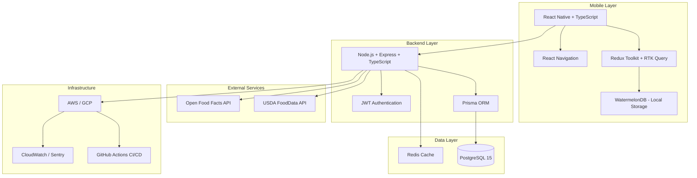

# Technology Stack Analysis & Recommendations

## Comprehensive Technology Comparison for Keyston

---

## Table of Contents
1. [Mobile Framework Comparison](#1-mobile-framework-comparison)
2. [Backend Framework Comparison](#2-backend-framework-comparison)
3. [Database Comparison](#3-database-comparison)
4. [State Management Comparison](#4-state-management-comparison)
5. [Nutrition API Comparison](#5-nutrition-api-comparison)
6. [Final Recommendations](#6-final-recommendations)

---

## 1. Mobile Framework Comparison

### Option A: React Native

**Pros**:
- ✅ **Large Ecosystem**: Extensive third-party libraries and community support
- ✅ **Code Reuse**: ~80-90% code sharing between iOS and Android
- ✅ **Hot Reload**: Fast development iteration with hot/live reload
- ✅ **JavaScript/TypeScript**: Accessible to web developers
- ✅ **Performance**: Near-native performance for most use cases
- ✅ **Mature**: Battle-tested by Facebook, Instagram, Airbnb (initially)
- ✅ **UI Libraries**: Rich component libraries (React Native Paper, NativeBase)
- ✅ **Camera Libraries**: Good barcode scanning support

**Cons**:
- ❌ **Bridge Overhead**: JavaScript-Native bridge can impact performance
- ❌ **App Size**: Larger app bundle sizes (typically 20-30MB)
- ❌ **Platform-Specific Code**: May need native modules for advanced features
- ❌ **Upgrade Challenges**: Breaking changes between versions

**Best For**: Cross-platform MVP with fast development cycles

---

### Option B: Flutter

**Pros**:
- ✅ **True Cross-Platform**: Single codebase for iOS, Android, Web, Desktop
- ✅ **Performance**: Compiled to native ARM code, no bridge
- ✅ **UI Consistency**: Pixel-perfect UI across platforms
- ✅ **Hot Reload**: Extremely fast iteration cycles
- ✅ **Growing Ecosystem**: Rapidly expanding plugin ecosystem
- ✅ **Google Support**: Backed by Google with strong investment
- ✅ **Material Design**: Excellent Material Design implementation
- ✅ **Smaller App Size**: Generally smaller than React Native

**Cons**:
- ❌ **Dart Language**: Smaller developer pool, less familiar than JavaScript
- ❌ **Younger Ecosystem**: Fewer mature libraries than React Native
- ❌ **Platform-Specific Features**: Some iOS-specific features lag behind
- ❌ **App Store Sizes**: Can be larger for simple apps

**Best For**: Performance-critical apps, long-term cross-platform strategy

---

### Option C: Native (Swift/Kotlin)

**Pros**:
- ✅ **Best Performance**: Maximum performance and efficiency
- ✅ **Platform Integration**: Full access to all platform features
- ✅ **Native UX**: Perfect platform-specific user experience
- ✅ **Apple/Google Support**: First-class support for new features
- ✅ **Debugging**: Superior debugging tools and profilers
- ✅ **App Size**: Smallest possible app size

**Cons**:
- ❌ **Separate Codebases**: 0% code sharing between platforms
- ❌ **Development Cost**: Requires iOS and Android developers
- ❌ **Slower Iteration**: Longer development cycles
- ❌ **2x Maintenance**: All features built twice

**Best For**: Performance-critical apps with platform-specific requirements

---

### Comparison Matrix

| Feature | React Native | Flutter | Native |
|---------|--------------|---------|--------|
| Development Speed | ⭐⭐⭐⭐⭐ | ⭐⭐⭐⭐ | ⭐⭐ |
| Performance | ⭐⭐⭐⭐ | ⭐⭐⭐⭐⭐ | ⭐⭐⭐⭐⭐ |
| Code Sharing | ⭐⭐⭐⭐⭐ | ⭐⭐⭐⭐⭐ | ⭐ |
| Developer Availability | ⭐⭐⭐⭐⭐ | ⭐⭐⭐ | ⭐⭐⭐⭐ |
| Third-Party Libraries | ⭐⭐⭐⭐⭐ | ⭐⭐⭐⭐ | ⭐⭐⭐⭐⭐ |
| Camera/Barcode Support | ⭐⭐⭐⭐⭐ | ⭐⭐⭐⭐ | ⭐⭐⭐⭐⭐ |
| UI Flexibility | ⭐⭐⭐⭐ | ⭐⭐⭐⭐⭐ | ⭐⭐⭐⭐⭐ |
| Maintenance Cost | ⭐⭐⭐⭐ | ⭐⭐⭐⭐ | ⭐⭐ |

### **Recommendation: React Native**

**Justification**:
- Fastest MVP development
- Large JavaScript developer pool
- Excellent barcode scanning libraries
- Mature ecosystem for health/fitness apps
- Good balance of performance and development speed
- Easy to migrate to native later if needed

---

## 2. Backend Framework Comparison

### Option A: Node.js + Express

**Pros**:
- ✅ **JavaScript Everywhere**: Same language as React Native frontend
- ✅ **NPM Ecosystem**: Largest package ecosystem
- ✅ **Async I/O**: Excellent for I/O-heavy operations (API calls)
- ✅ **JSON Native**: Natural JSON handling
- ✅ **Fast Development**: Quick to build REST APIs
- ✅ **Microservices**: Easy to scale horizontally

**Cons**:
- ❌ **CPU Intensive**: Slower for CPU-intensive tasks
- ❌ **Callback Hell**: Can be complex without async/await
- ❌ **Type Safety**: Requires TypeScript for type safety

**Best For**: API-heavy applications, real-time features

---

### Option B: Python + FastAPI

**Pros**:
- ✅ **Type Hints**: Native type checking with Pydantic
- ✅ **Performance**: Faster than Flask/Django for async operations
- ✅ **Documentation**: Auto-generated OpenAPI docs
- ✅ **Data Science**: Easy integration with ML libraries (future)
- ✅ **Clean Syntax**: Readable, maintainable code
- ✅ **Async Support**: Native async/await

**Cons**:
- ❌ **Different Language**: Context switching from JavaScript
- ❌ **Smaller Ecosystem**: Fewer packages than npm
- ❌ **Deployment**: More complex deployment than Node.js

**Best For**: ML-heavy applications, data processing

---

### Option C: Go

**Pros**:
- ✅ **Performance**: Extremely fast, compiled language
- ✅ **Concurrency**: Built-in goroutines for parallel processing
- ✅ **Type Safety**: Statically typed
- ✅ **Deployment**: Single binary deployment
- ✅ **Memory Efficient**: Lower memory footprint

**Cons**:
- ❌ **Learning Curve**: Different paradigm from JavaScript
- ❌ **Smaller Ecosystem**: Fewer libraries than Node/Python
- ❌ **Verbose**: More boilerplate code

**Best For**: High-performance microservices, concurrent processing

---

### Comparison Matrix

| Feature | Node.js + Express | Python + FastAPI | Go |
|---------|-------------------|------------------|-----|
| Development Speed | ⭐⭐⭐⭐⭐ | ⭐⭐⭐⭐ | ⭐⭐⭐ |
| Performance | ⭐⭐⭐ | ⭐⭐⭐⭐ | ⭐⭐⭐⭐⭐ |
| Type Safety | ⭐⭐⭐⭐ | ⭐⭐⭐⭐⭐ | ⭐⭐⭐⭐⭐ |
| Language Consistency | ⭐⭐⭐⭐⭐ | ⭐⭐ | ⭐⭐ |
| API Development | ⭐⭐⭐⭐⭐ | ⭐⭐⭐⭐⭐ | ⭐⭐⭐⭐ |
| Ecosystem | ⭐⭐⭐⭐⭐ | ⭐⭐⭐⭐ | ⭐⭐⭐ |
| Deployment | ⭐⭐⭐⭐ | ⭐⭐⭐ | ⭐⭐⭐⭐⭐ |

### **Recommendation: Node.js + Express + TypeScript**

**Justification**:
- JavaScript throughout the stack (React Native + Node.js)
- Fastest MVP development with existing JavaScript knowledge
- Excellent for API-heavy application (nutrition database calls)
- Large ecosystem of packages
- Easy hiring of JavaScript developers
- TypeScript adds type safety

---

## 3. Database Comparison

### Option A: PostgreSQL

**Pros**:
- ✅ **ACID Compliant**: Full transaction support
- ✅ **JSON Support**: Native JSON/JSONB for flexible data
- ✅ **Full-Text Search**: Built-in text search capabilities
- ✅ **Mature**: Battle-tested, reliable
- ✅ **Open Source**: Free, community-driven
- ✅ **Scalability**: Proven at scale
- ✅ **Data Integrity**: Strong consistency guarantees

**Cons**:
- ❌ **Schema Migrations**: Requires planning for schema changes
- ❌ **Vertical Scaling**: Can be expensive to scale vertically
- ❌ **Complexity**: More complex than NoSQL for simple use cases

**Best For**: Structured data with complex relationships

---

### Option B: MongoDB

**Pros**:
- ✅ **Flexible Schema**: Easy to iterate during development
- ✅ **JSON Native**: Natural document storage
- ✅ **Horizontal Scaling**: Built-in sharding
- ✅ **Developer Friendly**: Intuitive query language
- ✅ **Fast Reads**: Good read performance

**Cons**:
- ❌ **Weak Consistency**: Eventually consistent by default
- ❌ **No Joins**: Requires denormalization or multiple queries
- ❌ **Memory Hungry**: Higher memory usage
- ❌ **Transaction Support**: Limited compared to PostgreSQL

**Best For**: Rapidly changing schemas, document-heavy applications

---

### Option C: MySQL

**Pros**:
- ✅ **Widely Used**: Largest market share
- ✅ **ACID Compliant**: Full transaction support
- ✅ **Performance**: Excellent read performance
- ✅ **Mature**: Decades of production use

**Cons**:
- ❌ **Limited JSON**: Weaker JSON support than PostgreSQL
- ❌ **Licensing**: Some Oracle licensing concerns
- ❌ **Less Features**: Fewer advanced features than PostgreSQL

**Best For**: Traditional relational data, read-heavy workloads

---

### Comparison Matrix

| Feature | PostgreSQL | MongoDB | MySQL |
|---------|-----------|---------|-------|
| Data Integrity | ⭐⭐⭐⭐⭐ | ⭐⭐⭐ | ⭐⭐⭐⭐⭐ |
| Flexibility | ⭐⭐⭐⭐ | ⭐⭐⭐⭐⭐ | ⭐⭐⭐ |
| JSON Support | ⭐⭐⭐⭐⭐ | ⭐⭐⭐⭐⭐ | ⭐⭐⭐ |
| Query Complexity | ⭐⭐⭐⭐⭐ | ⭐⭐⭐ | ⭐⭐⭐⭐ |
| Scalability | ⭐⭐⭐⭐ | ⭐⭐⭐⭐⭐ | ⭐⭐⭐⭐ |
| Performance | ⭐⭐⭐⭐ | ⭐⭐⭐⭐ | ⭐⭐⭐⭐⭐ |
| Community | ⭐⭐⭐⭐⭐ | ⭐⭐⭐⭐ | ⭐⭐⭐⭐⭐ |

### **Recommendation: PostgreSQL**

**Justification**:
- Perfect for structured nutrition and workout data
- Strong relationships (users, diary entries, workouts)
- JSONB for flexible nutrition data (micronutrients)
- Excellent full-text search for food lookup
- Better data integrity for health data
- Easier migrations than MongoDB for structured data

---

## 4. State Management Comparison

### Option A: Redux Toolkit

**Pros**:
- ✅ **Industry Standard**: Most popular React state management
- ✅ **DevTools**: Excellent debugging with Redux DevTools
- ✅ **Time Travel**: Debug by rewinding state
- ✅ **Middleware**: Rich middleware ecosystem
- ✅ **RTK Query**: Built-in data fetching and caching
- ✅ **Predictable**: Single source of truth

**Cons**:
- ❌ **Boilerplate**: More setup code than alternatives
- ❌ **Learning Curve**: Steeper for beginners
- ❌ **Overhead**: Can be overkill for small apps

**Best For**: Complex state management, team collaboration

---

### Option B: React Context + Hooks

**Pros**:
- ✅ **Built-In**: No external dependencies
- ✅ **Simple**: Minimal boilerplate
- ✅ **Lightweight**: No bundle size impact
- ✅ **Flexible**: Easy to implement custom patterns

**Cons**:
- ❌ **Performance**: Can cause unnecessary re-renders
- ❌ **No DevTools**: Limited debugging capabilities
- ❌ **Prop Drilling**: Complex for deeply nested components

**Best For**: Simple apps, component-level state

---

### Option C: MobX

**Pros**:
- ✅ **Simple**: Less boilerplate than Redux
- ✅ **Reactive**: Automatic re-rendering on state changes
- ✅ **Flexible**: Multiple stores possible
- ✅ **Performance**: Optimized updates

**Cons**:
- ❌ **Magic**: Less explicit than Redux
- ❌ **Smaller Community**: Less popular than Redux
- ❌ **Debugging**: Harder to debug than Redux

**Best For**: Rapid development, smaller teams

---

### **Recommendation: Redux Toolkit + RTK Query**

**Justification**:
- Industry standard with excellent documentation
- RTK Query handles API caching automatically
- Perfect for offline-first architecture
- Excellent DevTools for debugging
- Team scalability and maintainability
- Built-in solutions for common patterns

---

## 5. Nutrition API Comparison

### Option A: USDA FoodData Central

**Details**:
- **Cost**: Free
- **API Key**: Required (free signup)
- **Rate Limit**: 1,000 requests/hour
- **Coverage**: 800,000+ foods
- **Data Quality**: ⭐⭐⭐⭐⭐ (Government verified)

**Pros**:
- ✅ Free to use
- ✅ Comprehensive USDA-verified data
- ✅ Detailed nutrient breakdowns
- ✅ Generic foods (no brand focus)
- ✅ Regular updates

**Cons**:
- ❌ Limited branded foods
- ❌ No barcode lookup
- ❌ Rate limits can be restrictive

**Best For**: Primary nutrition database, generic foods

---

### Option B: Open Food Facts

**Details**:
- **Cost**: Free
- **API Key**: Not required
- **Rate Limit**: Fair use policy
- **Coverage**: 2,000,000+ products
- **Data Quality**: ⭐⭐⭐⭐ (Crowdsourced)

**Pros**:
- ✅ Completely free and open source
- ✅ Barcode lookup supported
- ✅ Massive branded food database
- ✅ International coverage
- ✅ Community-driven updates

**Cons**:
- ❌ Data quality varies (crowdsourced)
- ❌ Some incomplete entries
- ❌ Requires data validation

**Best For**: Barcode scanning, branded products

---

### Option C: Nutritionix

**Details**:
- **Cost**: Paid (starts at $49/month)
- **API Key**: Required
- **Rate Limit**: 500-10,000 requests/day (plan-dependent)
- **Coverage**: 700,000+ branded foods
- **Data Quality**: ⭐⭐⭐⭐⭐ (Commercial-grade)

**Pros**:
- ✅ High-quality verified data
- ✅ Excellent barcode coverage
- ✅ Natural language processing
- ✅ Restaurant chain foods
- ✅ Professional support

**Cons**:
- ❌ Paid service (recurring cost)
- ❌ Rate limits on lower tiers
- ❌ Cost scales with usage

**Best For**: Premium tier, commercial applications

---

### Option D: MyFoodData / Edamam

**Details**:
- **Cost**: Free tier + paid plans
- **Coverage**: 500,000+ foods
- **Data Quality**: ⭐⭐⭐⭐

**Pros**:
- ✅ Free tier available
- ✅ Recipe analysis
- ✅ Meal planning features

**Cons**:
- ❌ Limited free tier
- ❌ Less comprehensive than USDA

**Best For**: Supplement to other sources

---

### Comparison Matrix

| API | Cost | Coverage | Quality | Barcode | Rate Limit |
|-----|------|----------|---------|---------|------------|
| USDA FoodData | Free | ⭐⭐⭐⭐⭐ | ⭐⭐⭐⭐⭐ | ❌ | 1K/hour |
| Open Food Facts | Free | ⭐⭐⭐⭐⭐ | ⭐⭐⭐⭐ | ✅ | Fair use |
| Nutritionix | Paid | ⭐⭐⭐⭐ | ⭐⭐⭐⭐⭐ | ✅ | Plan-based |
| MyFoodData | Freemium | ⭐⭐⭐ | ⭐⭐⭐⭐ | ❌ | Limited |

### **Recommendation: Multi-Source Strategy**

**Primary Sources**:
1. **USDA FoodData Central** - Generic foods, verified data
2. **Open Food Facts** - Barcode scanning, branded products

**Optional/Future**:
3. **Nutritionix** - Premium tier for enhanced branded food coverage

**Fallback Strategy**:
```
Search Query → USDA API
     ↓ (if no results)
     → Open Food Facts API
     ↓ (if still no results)
     → Allow manual entry
```

**Barcode Scan**:
```
Barcode → Open Food Facts API
     ↓ (if not found)
     → Allow manual entry with barcode saved
```

**Justification**:
- Maximizes free resources for MVP
- Combines best of both worlds (verified + branded)
- Provides good barcode coverage
- Can add Nutritionix later for premium features
- Redundancy ensures uptime

---

## 6. Final Recommendations

### Complete Technology Stack



### Summary Table

| Category | Choice | Justification |
|----------|--------|---------------|
| **Mobile Framework** | React Native + TypeScript | Fast MVP, large ecosystem, JavaScript consistency |
| **Backend** | Node.js + Express + TypeScript | JavaScript full-stack, async I/O, fast development |
| **Database** | PostgreSQL 15 | Strong relationships, JSONB, data integrity |
| **Cache** | Redis 7 | API response caching, session management |
| **State Management** | Redux Toolkit + RTK Query | Industry standard, excellent caching, DevTools |
| **Local Storage** | WatermelonDB | Reactive, fast, offline-first |
| **ORM** | Prisma | Type-safe, migrations, excellent DX |
| **Navigation** | React Navigation | Most popular, fully featured |
| **Primary Nutrition API** | USDA FoodData Central | Free, verified, comprehensive |
| **Barcode API** | Open Food Facts | Free, barcode support, large database |
| **Authentication** | JWT + Passport.js | Stateless, scalable |
| **Cloud** | AWS or GCP | Scalable, mature, comprehensive services |
| **CI/CD** | GitHub Actions | Free for public repos, integrated |
| **Monitoring** | Sentry + CloudWatch | Error tracking + infrastructure monitoring |
| **Analytics** | Firebase Analytics | Free, comprehensive, mobile-focused |

### Development Tools

| Purpose | Tool |
|---------|------|
| Code Quality | ESLint + Prettier |
| Testing | Jest + React Testing Library |
| E2E Testing | Detox |
| API Testing | Supertest |
| Documentation | Swagger/OpenAPI |
| Version Control | Git + GitHub |
| Project Management | GitHub Projects or Jira |

---

## Cost Estimation (Monthly)

### MVP Phase (First 3 Months)
- **Development**: Team cost (variable)
- **Infrastructure**: $50-100/month (AWS free tier + small instances)
- **APIs**: $0 (using free tiers)
- **Tools**: $0 (using free developer tools)

**Total MVP Infrastructure**: ~$100/month

### Production (First Year)
- **Infrastructure**: $200-500/month (auto-scaling, backups)
- **APIs**: $0-100/month (depending on premium API adoption)
- **Monitoring**: $50/month (Sentry, CloudWatch)
- **CDN**: $20-50/month

**Total Production**: ~$300-700/month

### Scaling (Year 2+)
- Costs scale with users
- May add Nutritionix API ($49-199/month)
- Increased infrastructure ($500-2000/month)
- Additional services as needed

---

*Document Version: 1.0*  
*Last Updated: November 2025*  
*Status: Draft for Review*
