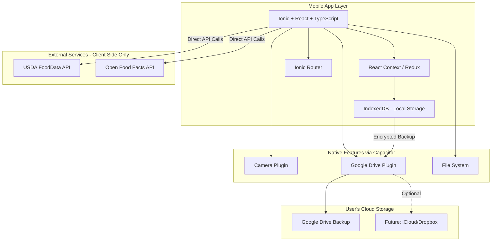

# Technology Stack Analysis & Recommendations

## Comprehensive Technology Comparison for Keyston

---

## Table of Contents
1. [Mobile Framework Comparison](#1-mobile-framework-comparison)
2. [Data Storage & Sync Strategy](#2-data-storage--sync-strategy)
3. [State Management Comparison](#3-state-management-comparison)
4. [Nutrition API Comparison](#4-nutrition-api-comparison)
5. [Final Recommendations](#5-final-recommendations---privacy-first-architecture)

---

## 1. Mobile Framework Comparison

### Option A: Ionic Framework + React

**Pros**:
- ✅ **Web Technology**: Uses standard HTML, CSS, JavaScript/TypeScript
- ✅ **React Integration**: Leverages existing React knowledge and ecosystem
- ✅ **Cross-Platform**: Single codebase for iOS, Android, and Web (PWA)
- ✅ **Web Developer Friendly**: Perfect for developers with web background
- ✅ **Capacitor**: Native access via Capacitor plugins (camera, storage, etc.)
- ✅ **UI Components**: Pre-built Ionic components with native look and feel
- ✅ **Fast Iteration**: Hot reload and familiar web development workflow
- ✅ **PWA Support**: Can deploy as Progressive Web App
- ✅ **Easier Debugging**: Use standard browser DevTools

**Cons**:
- ❌ **Performance**: WebView-based, slightly slower than native
- ❌ **Animation Performance**: Complex animations may not be as smooth
- ❌ **App Size**: Can be larger than pure native apps
- ❌ **Platform Feel**: May not feel 100% native without customization

**Best For**: Web developers transitioning to mobile, cross-platform apps prioritizing development speed

---

### Option B: React Native

**Pros**:
- ✅ **Large Ecosystem**: Extensive third-party libraries and community support
- ✅ **Code Reuse**: ~80-90% code sharing between iOS and Android
- ✅ **Hot Reload**: Fast development iteration with hot/live reload
- ✅ **Performance**: Near-native performance for most use cases
- ✅ **Mature**: Battle-tested by Facebook, Instagram, Airbnb (initially)
- ✅ **UI Libraries**: Rich component libraries (React Native Paper, NativeBase)

**Cons**:
- ❌ **Bridge Overhead**: JavaScript-Native bridge can impact performance
- ❌ **Not Web-Based**: Requires learning React Native-specific APIs
- ❌ **Platform-Specific Code**: May need native modules for advanced features
- ❌ **Upgrade Challenges**: Breaking changes between versions

**Best For**: Cross-platform native apps with React experience

---

### Option C: Flutter

**Pros**:
- ✅ **True Cross-Platform**: Single codebase for iOS, Android, Web, Desktop
- ✅ **Performance**: Compiled to native ARM code, no bridge
- ✅ **UI Consistency**: Pixel-perfect UI across platforms
- ✅ **Hot Reload**: Extremely fast iteration cycles
- ✅ **Material Design**: Excellent Material Design implementation

**Cons**:
- ❌ **Dart Language**: Smaller developer pool, less familiar than JavaScript
- ❌ **Not React-based**: Requires learning new framework
- ❌ **Platform-Specific Features**: Some iOS-specific features lag behind

**Best For**: Performance-critical apps, long-term cross-platform strategy

---

### Comparison Matrix

| Feature | Ionic + React | React Native | Flutter |
|---------|---------------|--------------|---------|
| Development Speed | ⭐⭐⭐⭐⭐ | ⭐⭐⭐⭐ | ⭐⭐⭐⭐ |
| Web Developer Friendly | ⭐⭐⭐⭐⭐ | ⭐⭐⭐ | ⭐⭐ |
| Performance | ⭐⭐⭐ | ⭐⭐⭐⭐ | ⭐⭐⭐⭐⭐ |
| Code Sharing | ⭐⭐⭐⭐⭐ | ⭐⭐⭐⭐⭐ | ⭐⭐⭐⭐⭐ |
| React Knowledge Reuse | ⭐⭐⭐⭐⭐ | ⭐⭐⭐⭐ | ⭐ |
| PWA Support | ⭐⭐⭐⭐⭐ | ⭐⭐ | ⭐⭐⭐ |
| Camera/Barcode Support | ⭐⭐⭐⭐ | ⭐⭐⭐⭐⭐ | ⭐⭐⭐⭐ |
| UI Flexibility | ⭐⭐⭐⭐ | ⭐⭐⭐⭐ | ⭐⭐⭐⭐⭐ |
| Maintenance Cost | ⭐⭐⭐⭐⭐ | ⭐⭐⭐⭐ | ⭐⭐⭐⭐ |

### **Recommendation: Ionic Framework + React**

**Justification**:
- Perfect for web developers with React experience
- Leverages existing React knowledge and ecosystem
- Fast development with familiar web technologies
- Cross-platform deployment (iOS, Android, Web/PWA)
- Easy debugging with browser DevTools
- Good Capacitor plugin ecosystem for native features
- Privacy-friendly: Can work fully offline with local storage
- No backend required - perfect for privacy-focused app

---

## 2. Data Storage & Sync Strategy

**Privacy-First Architecture**: No central backend server or cloud database

### Local Storage Options

#### Option A: IndexedDB + LocalStorage

**Pros**:
- ✅ **Web Standard**: Native browser API support
- ✅ **Large Capacity**: Can store GBs of data
- ✅ **Structured Data**: Query capabilities with IndexedDB
- ✅ **No Dependencies**: Built into browsers
- ✅ **Privacy**: All data stays on device

**Cons**:
- ❌ **API Complexity**: IndexedDB API can be verbose
- ❌ **Browser Variations**: Some inconsistencies across browsers

**Best For**: Web-based apps with moderate data needs

---

#### Option B: SQLite (via Capacitor)

**Pros**:
- ✅ **Relational Database**: Full SQL support
- ✅ **Performance**: Faster than IndexedDB for complex queries
- ✅ **Mature**: Battle-tested database engine
- ✅ **Cross-Platform**: Works on iOS, Android, Web
- ✅ **Privacy**: Local-only storage

**Cons**:
- ❌ **Plugin Required**: Needs Capacitor SQLite plugin
- ❌ **Web Limitations**: Falls back to IndexedDB on web

**Best For**: Apps with complex relational data

---

### Sync Strategy

#### Google Drive Integration (via Capacitor)

**Features**:
- ✅ **User-Controlled**: Users own their data in their Google Drive
- ✅ **Privacy**: No central database, data encrypted
- ✅ **Cross-Device**: Sync across user's devices
- ✅ **Backup**: Automatic backup to cloud storage
- ✅ **Offline-First**: App works fully offline, syncs when online

**Implementation**:
- Use Capacitor Google Drive plugin
- Store encrypted backup files in user's Google Drive
- Implement conflict resolution for multi-device changes
- Allow manual or automatic sync

**Future Options**:
- iCloud Drive for iOS users
- Dropbox integration
- OneDrive integration
- Local file export/import

### **Recommendation: IndexedDB + Google Drive Sync**

**Justification**:
- No backend infrastructure needed (zero hosting costs)
- Perfect privacy: data stays with user
- Works offline by default
- Familiar web technologies
- Google Drive widely adopted
- Can add more sync options later

---

## 3. State Management Comparison

### Option A: Redux Toolkit

**Pros**:
- ✅ **Industry Standard**: Most popular React state management
- ✅ **DevTools**: Excellent debugging with Redux DevTools
- ✅ **Time Travel**: Debug by rewinding state
- ✅ **Middleware**: Rich middleware ecosystem
- ✅ **RTK Query**: Built-in data fetching and caching
- ✅ **Predictable**: Single source of truth

**Cons**:
- ❌ **Boilerplate**: More setup code than alternatives
- ❌ **Learning Curve**: Steeper for beginners
- ❌ **Overhead**: Can be overkill for small apps

**Best For**: Complex state management, team collaboration

---

### Option B: React Context + Hooks

**Pros**:
- ✅ **Built-In**: No external dependencies
- ✅ **Simple**: Minimal boilerplate
- ✅ **Lightweight**: No bundle size impact
- ✅ **Flexible**: Easy to implement custom patterns

**Cons**:
- ❌ **Performance**: Can cause unnecessary re-renders
- ❌ **No DevTools**: Limited debugging capabilities
- ❌ **Prop Drilling**: Complex for deeply nested components

**Best For**: Simple apps, component-level state

---

### Option C: MobX

**Pros**:
- ✅ **Simple**: Less boilerplate than Redux
- ✅ **Reactive**: Automatic re-rendering on state changes
- ✅ **Flexible**: Multiple stores possible
- ✅ **Performance**: Optimized updates

**Cons**:
- ❌ **Magic**: Less explicit than Redux
- ❌ **Smaller Community**: Less popular than Redux
- ❌ **Debugging**: Harder to debug than Redux

**Best For**: Rapid development, smaller teams

---

### **Recommendation: React Context + Hooks (or Redux Toolkit for complex apps)**

**Justification**:
- React Context is sufficient for most privacy-focused local apps
- No API calls to manage (no need for RTK Query)
- Simpler architecture with less boilerplate
- Can upgrade to Redux later if state becomes complex
- Perfect for offline-first local storage
- Easier debugging for smaller teams

---

## 4. Nutrition API Comparison

**Privacy-First Approach**: Client-side API calls only, no data sent to our servers

### Option A: USDA FoodData Central

**Details**:
- **Cost**: Free
- **API Key**: Required (free signup)
- **Rate Limit**: 1,000 requests/hour
- **Coverage**: 800,000+ foods
- **Data Quality**: ⭐⭐⭐⭐⭐ (Government verified)

**Pros**:
- ✅ Free to use
- ✅ Comprehensive USDA-verified data
- ✅ Detailed nutrient breakdowns
- ✅ Generic foods (no brand focus)
- ✅ Regular updates

**Cons**:
- ❌ Limited branded foods
- ❌ No barcode lookup
- ❌ Rate limits can be restrictive

**Best For**: Primary nutrition database, generic foods

---

### Option B: Open Food Facts

**Details**:
- **Cost**: Free
- **API Key**: Not required
- **Rate Limit**: Fair use policy
- **Coverage**: 2,000,000+ products
- **Data Quality**: ⭐⭐⭐⭐ (Crowdsourced)

**Pros**:
- ✅ Completely free and open source
- ✅ Barcode lookup supported
- ✅ Massive branded food database
- ✅ International coverage
- ✅ Community-driven updates

**Cons**:
- ❌ Data quality varies (crowdsourced)
- ❌ Some incomplete entries
- ❌ Requires data validation

**Best For**: Barcode scanning, branded products

---

### Option C: Nutritionix

**Details**:
- **Cost**: Paid (starts at $49/month)
- **API Key**: Required
- **Rate Limit**: 500-10,000 requests/day (plan-dependent)
- **Coverage**: 700,000+ branded foods
- **Data Quality**: ⭐⭐⭐⭐⭐ (Commercial-grade)

**Pros**:
- ✅ High-quality verified data
- ✅ Excellent barcode coverage
- ✅ Natural language processing
- ✅ Restaurant chain foods
- ✅ Professional support

**Cons**:
- ❌ Paid service (recurring cost)
- ❌ Rate limits on lower tiers
- ❌ Cost scales with usage

**Best For**: Premium tier, commercial applications

---

### Option D: MyFoodData / Edamam

**Details**:
- **Cost**: Free tier + paid plans
- **Coverage**: 500,000+ foods
- **Data Quality**: ⭐⭐⭐⭐

**Pros**:
- ✅ Free tier available
- ✅ Recipe analysis
- ✅ Meal planning features

**Cons**:
- ❌ Limited free tier
- ❌ Less comprehensive than USDA

**Best For**: Supplement to other sources

---

### Comparison Matrix

| API | Cost | Coverage | Quality | Barcode | Rate Limit |
|-----|------|----------|---------|---------|------------|
| USDA FoodData | Free | ⭐⭐⭐⭐⭐ | ⭐⭐⭐⭐⭐ | ❌ | 1K/hour |
| Open Food Facts | Free | ⭐⭐⭐⭐⭐ | ⭐⭐⭐⭐ | ✅ | Fair use |
| Nutritionix | Paid | ⭐⭐⭐⭐ | ⭐⭐⭐⭐⭐ | ✅ | Plan-based |
| MyFoodData | Freemium | ⭐⭐⭐ | ⭐⭐⭐⭐ | ❌ | Limited |

### **Recommendation: Multi-Source Strategy**

**Primary Sources**:
1. **USDA FoodData Central** - Generic foods, verified data
2. **Open Food Facts** - Barcode scanning, branded products

**Optional/Future**:
3. **Nutritionix** - Premium tier for enhanced branded food coverage

**Fallback Strategy**:
```
Search Query → USDA API
     ↓ (if no results)
     → Open Food Facts API
     ↓ (if still no results)
     → Allow manual entry
```

**Barcode Scan**:
```
Barcode → Open Food Facts API
     ↓ (if not found)
     → Allow manual entry with barcode saved
```

**Justification**:
- Maximizes free resources for MVP
- Combines best of both worlds (verified + branded)
- Provides good barcode coverage
- Can add Nutritionix later for premium features
- Redundancy ensures uptime

---

## 5. Final Recommendations - Privacy-First Architecture

### Complete Technology Stack



### Summary Table

| Category | Choice | Justification |
|----------|--------|---------------|
| **Mobile Framework** | Ionic + React + TypeScript | Web developer friendly, React expertise, cross-platform |
| **State Management** | React Context + Hooks | Simple, no API calls to manage, sufficient for local app |
| **Local Storage** | IndexedDB | Browser standard, large capacity, privacy-friendly |
| **Sync Solution** | Google Drive via Capacitor | User controls data, privacy-first, no backend needed |
| **Navigation** | Ionic Router | Integrated with Ionic, familiar to React Router users |
| **Primary Nutrition API** | USDA FoodData Central | Free, verified, comprehensive, direct client calls |
| **Barcode API** | Open Food Facts | Free, barcode support, large database, privacy-friendly |
| **Authentication** | None | Privacy-first, no login required |
| **Backend Server** | None | Zero backend infrastructure, complete privacy |
| **Analytics** | None | Privacy-first, no user tracking |
| **Error Tracking** | Optional Local Logging | Privacy-friendly, no external services |

### Development Tools

| Purpose | Tool |
|---------|------|
| Code Quality | ESLint + Prettier |
| Testing | Jest + React Testing Library |
| E2E Testing | Cypress or Playwright |
| Build Tool | Vite or Create React App |
| Version Control | Git + GitHub |
| Project Management | GitHub Projects |

---

## Cost Estimation (Monthly)

### MVP Phase (First 3 Months)
- **Development**: Team cost (variable)
- **Infrastructure**: $0 (no backend, no hosting)
- **APIs**: $0 (USDA and Open Food Facts are free)
- **Tools**: $0 (using free developer tools)

**Total MVP Infrastructure**: **$0/month** 🎉

### Production (First Year)
- **Infrastructure**: $0 (no backend server)
- **APIs**: $0 (free nutrition APIs)
- **App Store Fees**: $99/year (Apple) + $25 one-time (Google)
- **Optional**: Domain for landing page ($12/year)

**Total Production**: **~$10/month** (app store fees amortized)

### Scaling (Year 2+)
- Costs remain minimal (no server scaling needed)
- May add premium nutrition API if needed ($49-199/month)
- No infrastructure costs regardless of user count
- **User data storage cost**: $0 (users provide their own Google Drive)

---

*Document Version: 1.0*  
*Last Updated: November 2025*  
*Status: Draft for Review*
